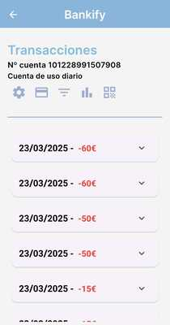
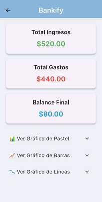

# Bankify - Aplicación Bancaria

## Descripción

Bankify es una aplicación bancaria completa desarrollada con Flutter y un conjunto de servicios backend que incluyen un servidor web en Nest.js, una API en Python con FastAPI, un servicio Spring Boot, y una integración con Odoo. La aplicación permite a los usuarios gestionar sus cuentas bancarias, realizar transacciones, visualizar tarjetas de crédito, y analizar sus finanzas a través de unas pantallas intuitivas.

El sistema está completamente dockerizado para facilitar su despliegue y cuenta con servicios de base de datos MySQL y PostgreSQL para almacenar la información de los usuarios y las transacciones.

### Características principales:

- **Autenticación de usuarios**: Inicio de sesión con soporte para autenticación biométrica
- **Gestión de cuentas**: Creación y visualización de cuentas bancarias
- **Transacciones**: Realizar y visualizar historial de transacciones
- **Tarjetas de crédito**: Gestión de tarjetas de crédito
- **Análisis financiero**: Gráficos y estadísticas de gastos e ingresos
- **Soporte multidioma**: Disponible en español, inglés y francés
- **Integración con servicios financieros**: API de cotizaciones bursátiles en tiempo real
- **Notificaciones**: Sistema de notificaciones para transacciones y alertas

## APK

La APK de la aplicación se puede descargar desde el siguiente enlace:
[Descargar APK de Bankify]([https://drive.google.com/file/d/1ctn91Ty-2tBAaC7zyAOWWnq9MLt-eook/view?usp=sharing](https://drive.google.com/file/d/1Ga6PdOFIqZAW3YLWxMMV-uoiSx9a7rZZ/view?usp=sharing))

El EXE de la aplicación de escritorio Datafono se puede descargar desde el siguiente enlace:
[Descargar EXE Datafono Bankify](https://drive.google.com/file/d/1fIcdnkWNnEuOIFkE4xbGrobXm3TCxyMt/view?usp=sharing)

## Manual de instalación y dependencias

### Requisitos previos

- Docker y Docker Compose
- Flutter SDK (versión 3.4.1 o superior)
- Git

### Instalación del entorno de desarrollo

1. **Clonar el repositorio**

```bash
git clone https://github.com/AndreuSempere/ProyectoFinal_Andreu.git
cd ProyectoFinal_Andreu
```

2. **Configurar el entorno**

Crea un archivo `.env` en la raíz del proyecto `flutter_bank_app_docker` y dentro de la carpeta `bank_app` con las variables de entorno necesarias (hay un archivo `.env.example` como referencia). Y otro .env en la app flutter_bank_app dentro de assets.

3. **Iniciar los servicios con Docker**

```bash
cd flutter_bank_app_docker
docker-compose build
docker-compose up -d
```

Este comando iniciará todos los servicios necesarios:

- Servidor web (NestJS)
- Base de datos MySQL
- PHPMyAdmin
- Base de datos PostgreSQL para Odoo
- Odoo ERP
- Servicio Spring Boot
- API financiera (Python/FastAPI)

4. **Ejecutar la aplicación Flutter**

```bash
cd flutter_bank_app
flutter pub get
flutter run
```

### Testing

Si quieres probar los test de pruebas del servidor de Nest.js ejcuta:

```bash
npm run test
```

### Dependencias principales

#### Aplicación Flutter:

- Flutter SDK >=3.4.1

#### API Financiera (Python):

- FastAPI
- yfinance
- requests

#### Servicio Spring Boot:

- Spring Boot
- Spring Data JPA
- MySQL Connector

## Tutorial de uso de la aplicación

### 1. Inicio de sesión

Al abrir la aplicación, se mostrará la pantalla de inicio de sesión donde podrás acceder con tu correo electrónico y contraseña. También tienes la opción de utilizar autenticación biométrica si tu dispositivo lo soporta.


### 2. Pantalla principal

Una vez autenticado, verás la pantalla principal con un resumen de tus cuentas bancarias. Desde aquí puedes:

- Ver el saldo de tus cuentas
- Crear nuevas cuentas bancarias
- Acceder al menú lateral para más opciones


### 3. Transacciones

En la sección de transacciones puedes:

- Ver el historial de transacciones
- Filtrar por fecha o tipo
- Realizar nuevas transferencias



### 4. Tarjetas de crédito

Gestiona tus tarjetas de crédito:

- Visualiza los detalles de tus tarjetas
- Activa o desactiva tarjetas
- Solicita nuevas tarjetas


### 5. Análisis financiero

Visualiza gráficos interactivos que muestran:

- Distribución de gastos por categoría
- Evolución de ingresos y gastos
- Comparativas mensuales



## Enlace a la presentación en formato PDF

[Descargar presentación del proyecto](https://drive.google.com/file/d/your-presentation-link/view)

## Bibliografía utilizada

### Tutoriales y recursos

- [Flutter OCR](https://medium.com/@frojho/flutter-projects-05-building-an-optical-character-recognition-ocr-app-639c165f857d)
- [Autentificación Face ID / Huella](https://medium.com/@dev.jocgomez/implementa-autenticaci%C3%B3n-biom%C3%A9trica-en-tu-proyecto-de-flutter-64b7d4f7c288)
- [Hacer peticiones a la API python](https://www.datacamp.com/es/tutorial/making-http-requests-in-python)
